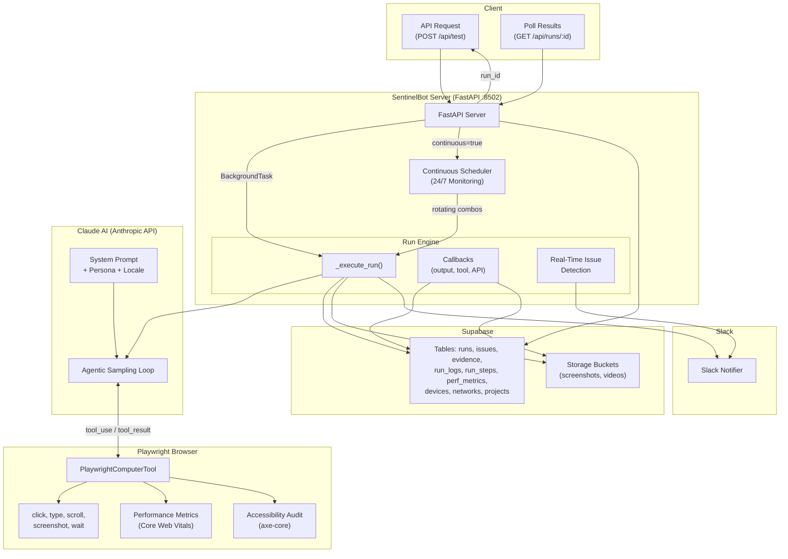

# SentinelBot Webwic

SentinelBot Webwic is a full-stack platform for managing automated QA runs, issues, evidence, and Slack ownership. It consists of three services:
- **Frontend**: React + Vite SPA for dashboards, runs, issues, evidence, and user management.
- **Backend API**: FastAPI service that provides auth, data access, and orchestration.
- **Sentinel Runner**: A separate FastAPI service that executes AI-driven Playwright runs and writes results to Supabase.

**What This Repo Contains**
- `frontend/` – Web UI (React, Vite, Tailwind, shadcn/ui).
- `backend/` – API server with Supabase Auth + Postgres + Storage.
- `sentinelbot/` – Autonomous QA runner (Claude + Playwright).
- `docs/docker-compose.yml` – Example deployment with prebuilt images.

**How The Services Connect**
- The frontend calls the backend API for auth, lists, issues, evidence, and users.
- The backend calls the Sentinel Runner through `TEST_SERVICE_URL` when you start a run.
- The Sentinel Runner reads and writes to Supabase and optionally posts to Slack.

---


## Architecture Overview



---

**Demo Video**
Click on the image to view demo video:
[](https://drive.google.com/file/d/1IQvkQfjvHsuefoAhzOE_3WMrDeNisOeg/view?usp=sharing)


**Configuration**
Each service has its own environment file:
- `backend/.env.example` → `backend/.env`
- `frontend/.env.example` → `frontend/.env`
- Sentinel Runner uses env vars documented in `sentinelbot/README.md`

If you use `docs/docker-compose.yml`, create:
- `docs/.env.backend` (based on `backend/.env.example`)
- `docs/.env.frontend` (based on `frontend/.env.example`)

**Local Development**
Backend:
```bash
cd backend
python -m venv .venv
source .venv/bin/activate
pip install -r requirements.txt
cp .env.example .env
uvicorn app:app --reload --host 0.0.0.0 --port 8000
```

Frontend:
```bash
cd frontend
npm install
cp .env.example .env
npm run dev
```

Sentinel Runner:
```bash
cd sentinelbot
python -m venv .venv
source .venv/bin/activate
pip install -r sentinel/requirements-sentinel.txt
python -m playwright install chromium
uvicorn sentinel.sentinel_server:app --host 0.0.0.0 --port 8502
```

Dev ports:
- Backend: `http://localhost:8000`
- Frontend: `http://localhost:8080` (Vite proxies API requests to the backend)
- Sentinel Runner: `http://localhost:8502`

**Docker**
Backend:
```bash
cd backend
docker build -t sentinel-backend .
docker run --rm -p 8000:8000 --env-file .env sentinel-backend
```

Frontend:
```bash
cd frontend
docker build -t sentinel-frontend .
docker run --rm -p 8080:80 sentinel-frontend
```

Sentinel Runner:
```bash
cd sentinelbot
docker build -f Dockerfile.sentinel -t sentinelbot:local .
docker run --rm -p 8502:8502 --env-file .env sentinelbot:local
```

**API Docs**
- Backend: `GET /docs`, `GET /redoc`
- Sentinel Runner: `GET /docs`

**More Details**
- Backend: `backend/README.md`
- Frontend: `frontend/README.md`
- Sentinel Runner: `sentinelbot/README.md`

---

