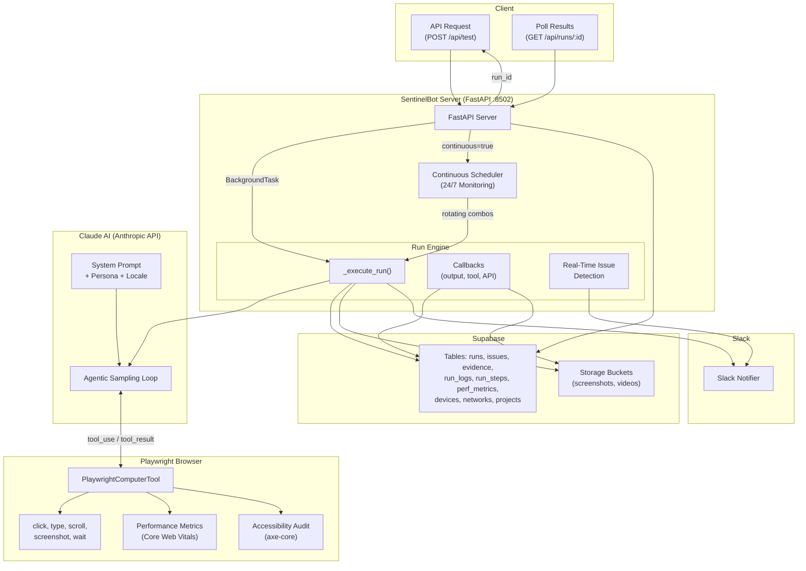

# SentinelBot

---

## What is SentinelBot?

SentinelBot is a QA testing service that uses **Claude AI** + **Playwright** to perform end-to-end testing on any web application. You give it a URL, a device to emulate, and optionally a persona (e.g., "elderly user", "impatient user") — it navigates your site, interacts with every element, and produces a structured bug report with:

- Categorized issues (P0–P3 severity)
- Screenshots at every step
- Video recordings of the full session
- Core Web Vitals performance metrics (LCP, CLS, TTFB, FCP)
- WCAG 2.1 AA accessibility audit results
- Root cause analysis linking similar issues across runs
- Regression detection (comparing against previous runs)
- Flaky test detection (automatic re-test of P0/P1 issues)

Everything is persisted to **Supabase** and optionally pushed to **Slack** in real-time.

---

## Architecture Overview



---


## Personas

SentinelBot can simulate different user behaviors to surface different types of issues:

| Persona | Behavior |
|---|---|
| `first_time_user` | Unfamiliar with the app, confused by jargon, needs clear affordances |
| `power_user` | Expects shortcuts, fast navigation, skips steps aggressively |
| `elderly_user` | Needs large text, high contrast, 44x44px touch targets |
| `non_technical_user` | Intimidated by technology, tries clicking non-interactive elements |
| `impatient_user` | Clicks before pages load, double-clicks everything, submits partial forms |
| `adversarial_user` | SQL injection, XSS payloads, emoji, extremely long text, boundary values |

---

## Environment Variables

| Variable | Required | Description |
|---|---|---|
| `ANTHROPIC_API_KEY` | Yes | Claude API key |
| `SUPABASE_URL` | Yes | Supabase project URL |
| `SUPABASE_SERVICE_KEY` | Yes | Supabase service role key |
| `SLACK_BOT_TOKEN` | No | Slack bot token for notifications |
| `SENTINEL_VIDEO_DIR` | No | Temp directory for video files (default: `/tmp/sentinel_videos`) |

---

## Quick Start

### Docker (Recommended)

```bash
docker build -f Dockerfile.sentinel -t sentinelbot:local .

docker run --env-file .env -p 8502:8502 -it sentinelbot:local
```

### Local

```bash
pip install -r sentinel/requirements-sentinel.txt
playwright install chromium

uvicorn sentinel.sentinel_server:app --host 0.0.0.0 --port 8502
```

### API Docs

Once the server is running, visit **http://localhost:8502/docs** for the interactive Swagger UI.

---

## Tech Stack

| Component | Technology |
|---|---|
| Server | FastAPI + Uvicorn |
| AI | Claude (Anthropic API) via agentic sampling loop |
| Browser | Playwright (headless Chromium) |
| Database | Supabase (PostgreSQL + Storage) |
| Notifications | Slack API |
| Container | Docker (Python 3.11 slim) |
