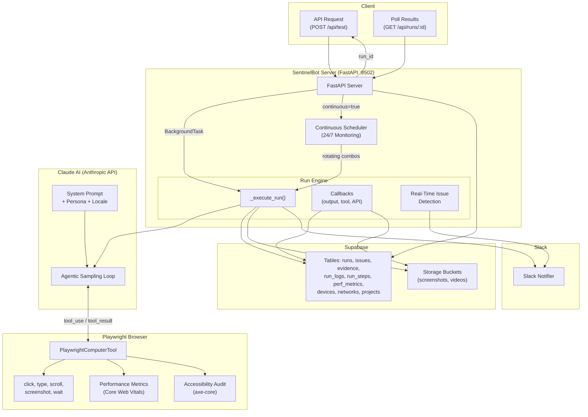

## Architecture Overview




---

## Core Design Principle

> **Claude Computer Use never controls the browser directly.**
> It only *sees* screenshots and *decides* actions.
> Playwright executes those actions.

This separation ensures:

* Safety
* Auditability
* Environment-agnostic AI
* Production-ready design

---

## Component Breakdown

### 1. Operator Dashboard (Lovable UI)

* Start / stop runs
* Select device (iPhone SE, Pixel, etc.)
* Select network (WiFi, 4G, Slow 3G)
* Select locale & persona
* View live run logs
* Preview Slack alerts and evidence

---

### 2. Run Orchestrator API

Responsible for:

* Creating a new `run_id`
* Applying guardrails (staging-only, rate limits)
* Spinning up a fresh Playwright context per run
* Detecting “stuck” conditions (timeouts, retries, no screen change)

This is the **control plane** of the system.

---

### 3. Playwright Runner (Mobile Emulation)

* Uses official device profiles (mobile viewport, touch input)
* Simulates real mobile web conditions
* Applies network throttling and latency
* Captures screenshots on every step
* Optionally records short screen clips

Each run is **fully isolated and disposable**.

---

### 4. Claude Computer Use (Vision Brain)

Input:

* Current screenshot
* Goal: complete signup
* Instructions to behave like a first-time (possibly confused) user

Output:

```json
{
  "thought": "...",
  "action": {
    "type": "tap | type | scroll | wait | stop",
    "x": 182,
    "y": 610,
    "text": "optional",
    "reason": "..."
  }
}
```

Claude:

* Interprets UI visually
* Identifies likely next action
* Mimics human hesitation or confusion when unclear

---

### 5. Action Executor

* Converts Claude’s action JSON into Playwright inputs
* Executes taps, typing, scrolling, or waits
* Logs every action with timestamps

This creates a **fully auditable action trail**.

---

### 6. Observability Layer

Tracks:

* Time spent on each screen
* Number of retries
* Action loops
* Waiting/spinner durations

Used to detect **user frustration signals**.

---

### 7. Stuck Detection Logic

Triggers when:

* Same screen persists beyond a threshold
* Multiple actions produce no UI change
* Spinner/loading lasts too long
* No actionable UI detected

This is when the system switches from **navigation mode** to **diagnosis mode**.

---

### 8. Diagnosis Engine (LLM)

Given:

* Last screenshots
* Action history
* Time spent
* Visible error text (OCR)

The LLM classifies:

* Root cause category:

  * Backend
  * Frontend/UI
  * UX/Copy
  * Performance
  * Integration
* Severity (P0–P3)
* Plain-English explanation
* Suggested reproduction steps

---

### 9. Evidence Store

Stores:

* Failure screenshots
* Optional 10-second screen recordings
* Metadata (device, locale, network, run_id)

Used for debugging and alerts.

---

### 10. Issue Router

Maps diagnosis → responsible team:

* Backend → API team
* UI glitch → Frontend/Design
* Copy confusion → UX/Content
* Timeout → Infra/Performance

---

### 11. Slack / Teams Alerting

Creates a live alert containing:

* Severity badge
* Root cause category
* Device / network / locale
* AI diagnosis
* Screenshot + clip
* Suggested owner
* Reproduction steps

This is the **“wow moment”** in the demo.

---

## Runtime Execution Flow

1. Operator clicks **Run**
2. Orchestrator spins up a mobile Playwright context
3. Screenshot captured
4. Claude Computer Use analyzes screenshot
5. Claude outputs next action
6. Action executor performs it
7. Loop continues until:

   * Signup completes OR
   * Agent gets stuck
8. If stuck:

   * Diagnosis engine runs
   * Issue is classified and scored
   * Evidence attached
   * Slack alert sent in real time
9. Dashboard updates with results

---

## Why This Architecture Wins a Hackathon

* No brittle selectors or scripts
* True vision-based navigation
* Human-like confusion detection
* Clear separation of concerns
* Live alerting with evidence
* Scales across devices, locales, and networks
* Easy to extend to native apps later

---

## Key One-Line Explanation for Judges

> “We don’t automate clicks.
> We simulate a real human user using vision, detect frustration, diagnose the cause, and escalate it instantly with evidence.”

---

```

If you want, next I can:
- simplify this into **one slide** for pitching
- give you a **runtime sequence diagram**
- help you **fake a realistic bug** for demo day
- convert this into a **Notion-style doc** for submission

Just tell me.
```
